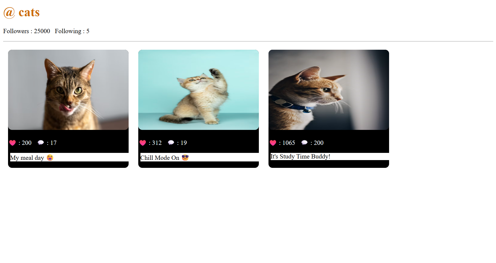
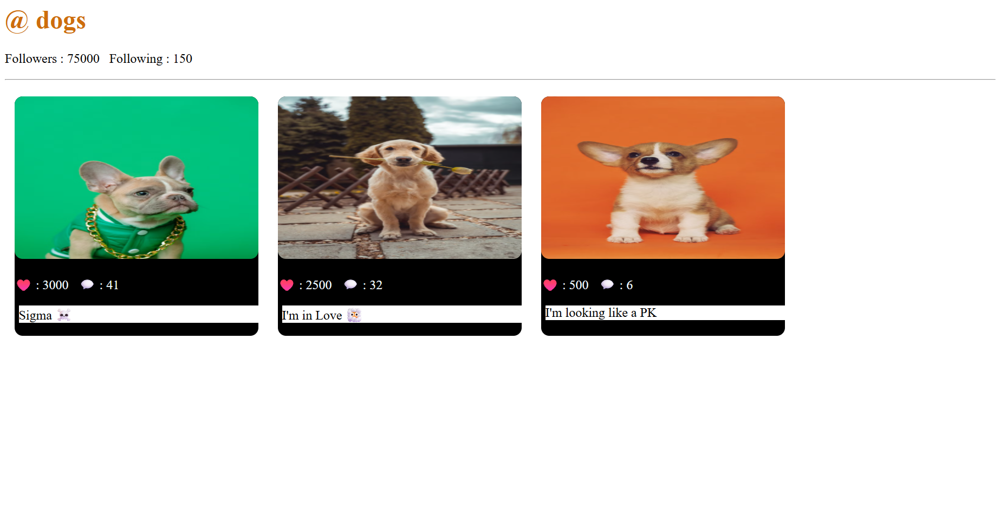

# EJS Basics — Instagram-like Profile Viewer (Express + EJS)

A compact, easy-to-read demonstration app that renders profile pages from a JSON dataset using Express and EJS.

This README provides quick start instructions, examples of how to produce small dynamic outputs (profile lists), and a sample rendered output image embedded below.

## Quick start
 
- Prerequisites: Node.js (>= 12) and npm
- Install dependencies:

```powershell
npm install
```

- Start the app:

```powershell
npm run start # or: node index.js
```

The server listens on port 3000 by default. Visit:

- http://localhost:3000/ig/cats
- http://localhost:3000/ig/dogs

If you request a username not present in `data.json`, the app renders the `views/error.ejs` page.

## Live sample output

Embedded below is a small sample image demonstrating the rendered profile layout. This SVG is included in the `output/` folder and is safe to preview on GitHub.




## Project layout (what to edit)

- `index.js` — Express entry point, sets EJS view engine, serves static files from `public/`, and defines the `/ig/:username` route.
- `data.json` — dataset mapping usernames to profile objects. Each profile typically contains `name`, `followers`, `following`, and `posts` (with `image`, `description`, `likes`, `comments`).
- `views/page.ejs` — profile page template.
- `views/error.ejs` — shown when a username is missing.
- `public/` — static assets (CSS, images). Add any images referenced by posts here or in your templates.
- `output/image.png` 
- `output/image2.png` — sample embedded output used in this README.— sample embedded output used in this README.

## Adding a new profile

1. Open `data.json` and add a top-level key following the existing structure (see `cats` / `dogs`):

```json
"bunnies": {
  "name": "bunnies",
  "followers": 1000,
  "following": 10,
  "posts": [ { "image": "https://...", "description": "cute", "likes": 10, "comments": 1 } ]
}
```

2. Restart the server (if running) and visit `http://localhost:3000/ig/bunnies`.

